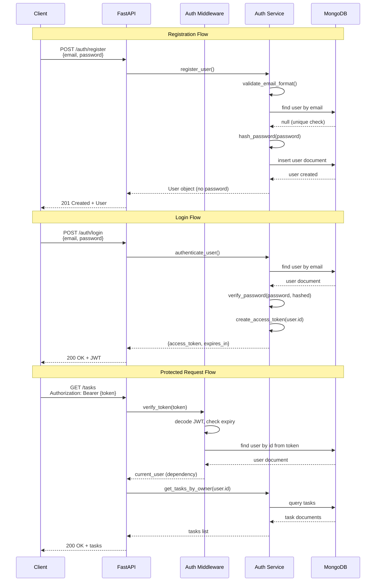

# Backend Architecture

## Service Architecture

### Controller/Route Organization

```
backend/
├── src/
│   ├── main.py                       # FastAPI app initialization and startup
│   ├── core/
│   │   ├── config.py                 # Environment variable configuration
│   │   ├── security.py               # JWT utilities, password hashing
│   │   └── database.py               # MongoDB client and connection
│   │
│   ├── api/
│   │   └── v1/
│   │       ├── __init__.py
│   │       ├── auth.py               # Auth routes (/auth/*)
│   │       ├── tasks.py              # Task routes (/tasks, /tasks/:id)
│   │       └── labels.py             # Label routes (/labels, /labels/:id)
│   │
│   ├── services/
│   │   ├── __init__.py
│   │   ├── auth_service.py           # Auth business logic
│   │   ├── task_service.py           # Task business logic
│   │   └── label_service.py          # Label business logic
│   │
│   ├── repositories/
│   │   ├── __init__.py
│   │   ├── user_repository.py        # User database operations
│   │   ├── task_repository.py        # Task database operations
│   │   └── label_repository.py       # Label database operations
│   │
│   ├── models/
│   │   ├── __init__.py
│   │   ├── user.py                   # User Pydantic model
│   │   ├── task.py                   # Task Pydantic models
│   │   └── label.py                  # Label Pydantic models
│   │
│   ├── schemas/
│   │   ├── __init__.py
│   │   ├── auth.py                   # Auth request/response schemas
│   │   ├── task.py                   # Task request/response schemas
│   │   └── label.py                  # Label request/response schemas
│   │
│   └── middleware/
│       ├── __init__.py
│       ├── auth_middleware.py        # JWT verification dependency
│       └── cors_middleware.py        # CORS configuration
│
├── tests/
│   ├── __init__.py
│   ├── conftest.py                   # Pytest fixtures
│   ├── test_auth.py
│   ├── test_tasks.py
│   └── test_labels.py
│
├── .env                              # Environment variables (gitignored)
├── .env.example                      # Environment variable template
├── pyproject.toml                    # Poetry configuration
├── requirements.txt                  # Pip dependencies
└── README.md
```

### Controller Template

```python
# api/v1/tasks.py - Task routes (controller layer)

from fastapi import APIRouter, Depends, HTTPException, status
from typing import List
from bson import ObjectId

from src.middleware.auth_middleware import get_current_user
from src.services.task_service import TaskService
from src.schemas.task import TaskCreate, TaskUpdate, TaskResponse
from src.models.user import User

router = APIRouter(prefix="/tasks", tags=["tasks"])

@router.get("/", response_model=List[TaskResponse])
async def get_tasks(
    current_user: User = Depends(get_current_user),
    task_service: TaskService = Depends()
):
    """Get all tasks for the authenticated user."""
    tasks = await task_service.get_tasks_by_owner(current_user.id)
    return tasks

@router.post("/", response_model=TaskResponse, status_code=status.HTTP_201_CREATED)
async def create_task(
    task_data: TaskCreate,
    current_user: User = Depends(get_current_user),
    task_service: TaskService = Depends()
):
    """Create a new task."""
    task = await task_service.create_task(current_user.id, task_data)
    return task

@router.patch("/{task_id}", response_model=TaskResponse)
async def update_task(
    task_id: str,
    task_data: TaskUpdate,
    current_user: User = Depends(get_current_user),
    task_service: TaskService = Depends()
):
    """Update an existing task."""
    if not ObjectId.is_valid(task_id):
        raise HTTPException(status_code=400, detail="Invalid task ID format")
    
    task = await task_service.update_task(task_id, current_user.id, task_data)
    if not task:
        raise HTTPException(status_code=404, detail="Task not found")
    
    return task

@router.delete("/{task_id}", status_code=status.HTTP_204_NO_CONTENT)
async def delete_task(
    task_id: str,
    current_user: User = Depends(get_current_user),
    task_service: TaskService = Depends()
):
    """Delete a task."""
    if not ObjectId.is_valid(task_id):
        raise HTTPException(status_code=400, detail="Invalid task ID format")
    
    deleted = await task_service.delete_task(task_id, current_user.id)
    if not deleted:
        raise HTTPException(status_code=404, detail="Task not found")
    
    return None
```

## Database Architecture

### Data Access Layer

```python
# repositories/task_repository.py - Task repository pattern

from motor.motor_asyncio import AsyncIOMotorDatabase
from bson import ObjectId
from typing import List, Optional
from datetime import datetime

from src.models.task import Task, TaskInDB

class TaskRepository:
    def __init__(self, db: AsyncIOMotorDatabase):
        self.collection = db.tasks

    async def create(self, task_data: dict) -> TaskInDB:
        """Insert a new task document."""
        task_data['created_at'] = datetime.utcnow()
        task_data['updated_at'] = datetime.utcnow()
        
        result = await self.collection.insert_one(task_data)
        task_data['_id'] = result.inserted_id
        
        return TaskInDB(**task_data)

    async def find_by_owner(self, owner_id: ObjectId) -> List[TaskInDB]:
        """Find all tasks belonging to a user, sorted by created_at desc."""
        cursor = self.collection.find(
            {'owner_id': owner_id}
        ).sort('created_at', -1)
        
        tasks = await cursor.to_list(length=None)
        return [TaskInDB(**task) for task in tasks]

    async def find_by_id(self, task_id: ObjectId, owner_id: ObjectId) -> Optional[TaskInDB]:
        """Find a task by ID, ensuring it belongs to the owner."""
        task = await self.collection.find_one({
            '_id': task_id,
            'owner_id': owner_id
        })
        
        return TaskInDB(**task) if task else None

    async def update(self, task_id: ObjectId, owner_id: ObjectId, update_data: dict) -> Optional[TaskInDB]:
        """Update a task's fields."""
        update_data['updated_at'] = datetime.utcnow()
        
        result = await self.collection.find_one_and_update(
            {'_id': task_id, 'owner_id': owner_id},
            {'$set': update_data},
            return_document=True
        )
        
        return TaskInDB(**result) if result else None

    async def delete(self, task_id: ObjectId, owner_id: ObjectId) -> bool:
        """Delete a task."""
        result = await self.collection.delete_one({
            '_id': task_id,
            'owner_id': owner_id
        })
        
        return result.deleted_count > 0

    async def remove_label_from_all_tasks(self, label_id: ObjectId, owner_id: ObjectId):
        """Remove a label ID from all tasks (cascade delete)."""
        await self.collection.update_many(
            {'owner_id': owner_id},
            {'$pull': {'label_ids': label_id}}
        )
```

## Authentication and Authorization

### Auth Flow



### Middleware/Guards

```python
# middleware/auth_middleware.py - JWT verification dependency

from fastapi import Depends, HTTPException, status
from fastapi.security import HTTPBearer, HTTPAuthCredentials
from jose import JWTError, jwt
from datetime import datetime
from bson import ObjectId

from src.core.config import settings
from src.core.database import get_database
from src.repositories.user_repository import UserRepository
from src.models.user import User

security = HTTPBearer()

async def get_current_user(
    credentials: HTTPAuthCredentials = Depends(security),
    db = Depends(get_database)
) -> User:
    """
    FastAPI dependency that verifies JWT token and returns current user.
    Raises 401 Unauthorized if token is invalid, expired, or user not found.
    """
    token = credentials.credentials
    
    credentials_exception = HTTPException(
        status_code=status.HTTP_401_UNAUTHORIZED,
        detail="Could not validate credentials",
        headers={"WWW-Authenticate": "Bearer"},
    )
    
    try:
        payload = jwt.decode(
            token,
            settings.JWT_SECRET,
            algorithms=[settings.JWT_ALGORITHM]
        )
        
        user_id: str = payload.get("sub")
        if user_id is None:
            raise credentials_exception
        
        exp = payload.get("exp")
        if exp is None or datetime.utcnow().timestamp() > exp:
            raise HTTPException(
                status_code=status.HTTP_401_UNAUTHORIZED,
                detail="Token has expired"
            )
        
    except JWTError:
        raise credentials_exception
    
    # Fetch user from database
    user_repo = UserRepository(db)
    user = await user_repo.find_by_id(ObjectId(user_id))
    
    if user is None:
        raise credentials_exception
    
    return user

# core/security.py - Password hashing and JWT generation

from passlib.context import CryptContext
from jose import jwt
from datetime import datetime, timedelta
from typing import Optional

from src.core.config import settings

pwd_context = CryptContext(schemes=["bcrypt"], deprecated="auto")

def hash_password(password: str) -> str:
    """Hash a password using bcrypt."""
    return pwd_context.hash(password)

def verify_password(plain_password: str, hashed_password: str) -> bool:
    """Verify a password against its hash."""
    return pwd_context.verify(plain_password, hashed_password)

def create_access_token(user_id: str, expires_delta: Optional[timedelta] = None) -> str:
    """Create a JWT access token."""
    if expires_delta is None:
        expires_delta = timedelta(seconds=settings.JWT_EXPIRES_IN)
    
    expire = datetime.utcnow() + expires_delta
    
    payload = {
        "sub": user_id,
        "exp": expire.timestamp(),
        "iat": datetime.utcnow().timestamp()
    }
    
    return jwt.encode(payload, settings.JWT_SECRET, algorithm=settings.JWT_ALGORITHM)
```


---
