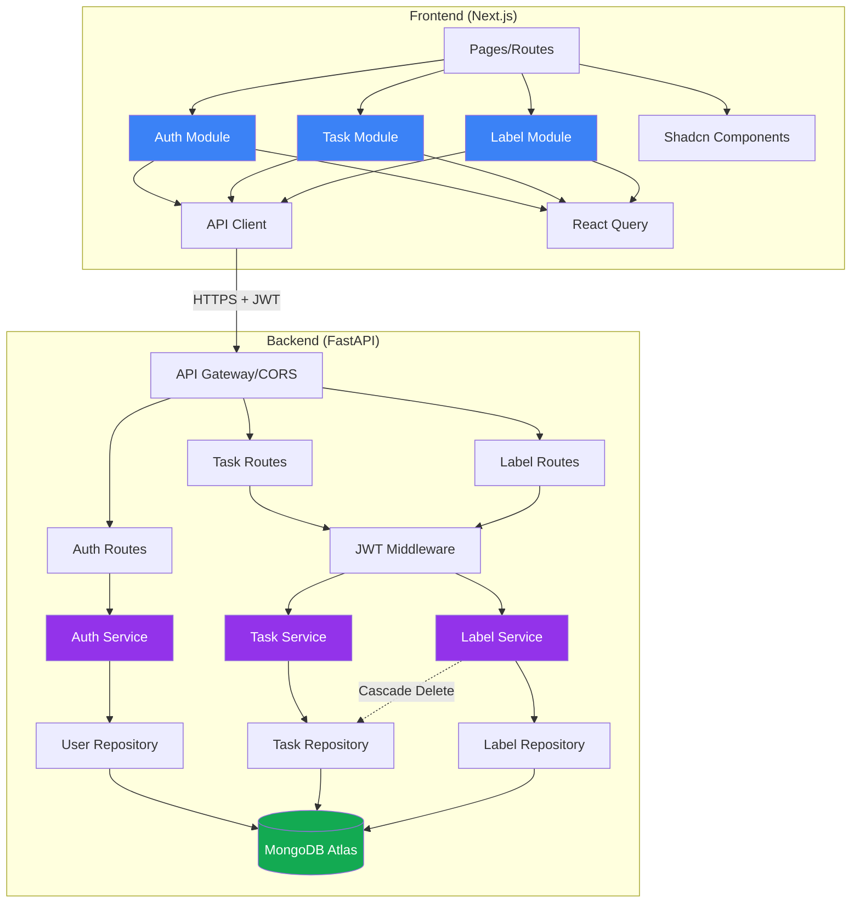

# Components

## Frontend Components

### Authentication Module
**Responsibility:** Handles user registration, login, logout, and auth state management

**Key Interfaces:**
- `useAuth()` hook - Provides auth context (user, login, logout, register functions)
- `<ProtectedRoute>` wrapper - Redirects to login if unauthenticated
- Login and Register page components

**Dependencies:** API Client, React Query, Next.js router

**Technology Stack:** Next.js App Router pages, React Context API, React Query for auth API calls, Zod validation

### Task Management Module
**Responsibility:** Task CRUD operations, task list display, task forms

**Key Interfaces:**
- Task List page component - Displays all user tasks
- Task Create/Edit modals - Forms for task operations
- `useTasks()` hook - React Query wrapper for task API calls
- `useTask(id)` hook - Single task fetching

**Dependencies:** API Client, Auth Module (protected routes), Shadcn UI components

**Technology Stack:** Next.js pages, React Query mutations/queries, Shadcn Dialog/Form/Card components, Zod validation

### Label Management Module
**Responsibility:** Label CRUD operations, label assignment to tasks

**Key Interfaces:**
- Labels page component - Label list and management
- Label picker component - Multi-select for task forms
- `useLabels()` hook - React Query wrapper for label API calls

**Dependencies:** API Client, Auth Module, Shadcn UI components

**Technology Stack:** Next.js pages, React Query, Shadcn Select/Checkbox components

### API Client
**Responsibility:** Centralized HTTP client with JWT token injection and error handling

**Key Interfaces:**
- `apiClient.get/post/patch/delete()` methods
- Automatic Authorization header injection
- Standardized error response parsing

**Dependencies:** Auth context for token access

**Technology Stack:** Fetch API or Axios, TypeScript interfaces for API contracts

---

## Backend Components

### Authentication Service
**Responsibility:** User registration, login, password hashing, JWT generation and verification

**Key Interfaces:**
- `register_user(email, password)` - Creates new user
- `authenticate_user(email, password)` - Verifies credentials
- `create_access_token(user_id)` - Generates JWT
- `verify_token(token)` - Validates and decodes JWT

**Dependencies:** User Repository, bcrypt, PyJWT

**Technology Stack:** FastAPI routes (`/auth/*`), Pydantic models, bcrypt for hashing, PyJWT for tokens

### Task Service
**Responsibility:** Business logic for task operations

**Key Interfaces:**
- `create_task(owner_id, task_data)` - Creates new task
- `get_tasks_by_owner(owner_id)` - Retrieves user's tasks
- `update_task(task_id, owner_id, updates)` - Updates task with ownership check
- `delete_task(task_id, owner_id)` - Deletes task with ownership check

**Dependencies:** Task Repository, Label Repository (for validation)

**Technology Stack:** Python classes, async methods, Pydantic models for validation

### Label Service
**Responsibility:** Business logic for label operations including uniqueness and cascade deletion

**Key Interfaces:**
- `create_label(owner_id, name)` - Creates label with uniqueness check
- `get_labels_by_owner(owner_id)` - Retrieves user's labels
- `update_label(label_id, owner_id, name)` - Updates label with uniqueness check
- `delete_label(label_id, owner_id)` - Deletes label and removes from all tasks

**Dependencies:** Label Repository, Task Repository (for cascade deletion)

**Technology Stack:** Python classes, async methods, Pydantic models

### Database Repositories
**Responsibility:** Abstract MongoDB operations for each collection

**Key Interfaces:**
- User Repository: CRUD operations on users collection
- Task Repository: CRUD operations on tasks collection, ownership filtering
- Label Repository: CRUD operations on labels collection, uniqueness checking

**Dependencies:** MongoDB client (Motor or Beanie)

**Technology Stack:** Motor (async MongoDB driver) or Beanie (ODM), Pydantic models

### Middleware Layer
**Responsibility:** JWT verification, CORS configuration, request logging

**Key Interfaces:**
- `get_current_user(token)` - FastAPI dependency for protected routes
- CORS middleware for frontend origin
- Error handling middleware for consistent error responses

**Dependencies:** Authentication Service

**Technology Stack:** FastAPI dependencies, Starlette middleware

---

## Component Diagram

---
