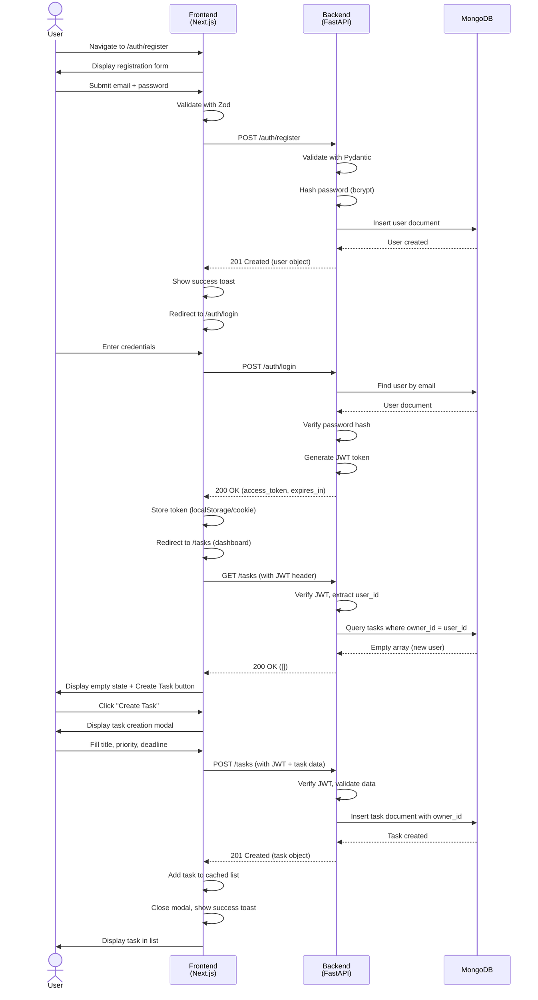
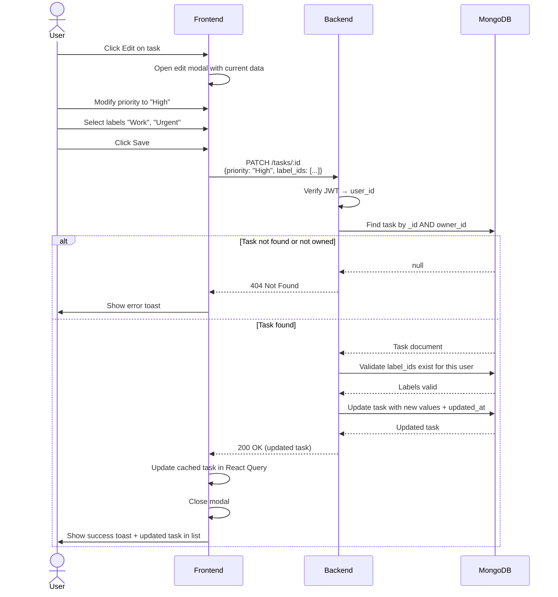

# Core Workflows

## User Registration and First Task Creation

```mermaid
sequenceDiagram
    actor User
    participant FE as Frontend<br/>(Next.js)
    participant BE as Backend<br/>(FastAPI)
    participant DB as MongoDB

    User->>FE: Navigate to /auth/register
    FE->>User: Display registration form
    
    User->>FE: Submit email + password
    FE->>FE: Validate with Zod
    
    FE->>BE: POST /auth/register
    BE->>BE: Validate with Pydantic
    BE->>BE: Hash password (bcrypt)
    BE->>DB: Insert user document
    DB-->>BE: User created
    BE-->>FE: 201 Created (user object)
    
    FE->>FE: Show success toast
    FE->>FE: Redirect to /auth/login
    
    User->>FE: Enter credentials
    FE->>BE: POST /auth/login
    BE->>DB: Find user by email
    DB-->>BE: User document
    BE->>BE: Verify password hash
    BE->>BE: Generate JWT token
    BE-->>FE: 200 OK (access_token, expires_in)
    
    FE->>FE: Store token (localStorage/cookie)
    FE->>FE: Redirect to /tasks (dashboard)
    FE->>BE: GET /tasks (with JWT header)
    BE->>BE: Verify JWT, extract user_id
    BE->>DB: Query tasks where owner_id = user_id
    DB-->>BE: Empty array (new user)
    BE-->>FE: 200 OK ([])
    
    FE->>User: Display empty state + Create Task button
    
    User->>FE: Click "Create Task"
    FE->>User: Display task creation modal
    User->>FE: Fill title, priority, deadline
    
    FE->>BE: POST /tasks (with JWT + task data)
    BE->>BE: Verify JWT, validate data
    BE->>DB: Insert task document with owner_id
    DB-->>BE: Task created
    BE-->>FE: 201 Created (task object)
    
    FE->>FE: Add task to cached list
    FE->>FE: Close modal, show success toast
    FE->>User: Display task in list
```

## Task Update with Label Assignment

```mermaid
sequenceDiagram
    actor User
    participant FE as Frontend
    participant BE as Backend
    participant DB as MongoDB

    User->>FE: Click Edit on task
    FE->>FE: Open edit modal with current data
    
    User->>FE: Modify priority to "High"
    User->>FE: Select labels "Work", "Urgent"
    User->>FE: Click Save
    
    FE->>BE: PATCH /tasks/:id<br/>{priority: "High", label_ids: [...]}
    BE->>BE: Verify JWT → user_id
    BE->>DB: Find task by _id AND owner_id
    
    alt Task not found or not owned
        DB-->>BE: null
        BE-->>FE: 404 Not Found
        FE->>User: Show error toast
    else Task found
        DB-->>BE: Task document
        BE->>DB: Validate label_ids exist for this user
        DB-->>BE: Labels valid
        BE->>DB: Update task with new values + updated_at
        DB-->>BE: Updated task
        BE-->>FE: 200 OK (updated task)
        
        FE->>FE: Update cached task in React Query
        FE->>FE: Close modal
        FE->>User: Show success toast + updated task in list
    end
```

---
