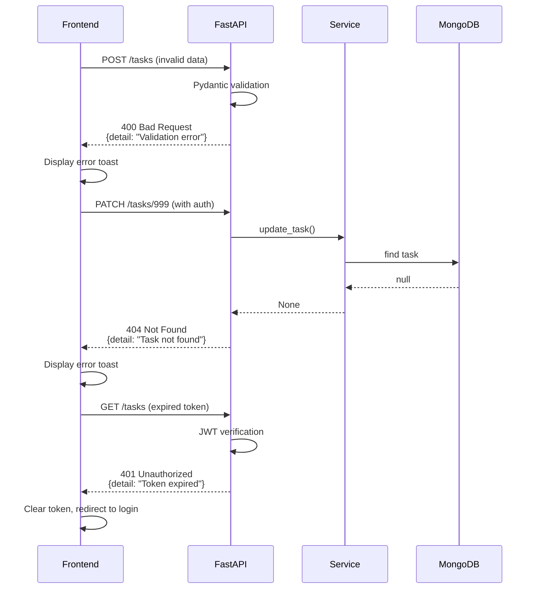

# Error Handling Strategy

## Error Flow



## Error Response Format

```typescript
interface ApiError {
  detail: string;
  // Optionally include:
  field?: string;  // For validation errors
  code?: string;   // Error code for programmatic handling
}

// Backend example
raise HTTPException(
    status_code=400,
    detail="Task title cannot be empty"
)

// Frontend error handling
try {
  await apiClient.post('/tasks', data);
} catch (error) {
  toast.error(error.message || 'An error occurred');
}
```

## Frontend Error Handling

```typescript
// lib/api.ts - Centralized error handling

private async request<T>(endpoint: string, options: RequestInit = {}): Promise<T> {
  const response = await fetch(`${this.baseURL}${endpoint}`, config);

  if (!response.ok) {
    // Handle auth errors
    if (response.status === 401) {
      localStorage.removeItem('access_token');
      window.location.href = '/auth/login';
      throw new Error('Session expired. Please log in again.');
    }

    // Parse error response
    const error = await response.json().catch(() => ({ detail: 'Unknown error' }));
    throw new Error(error.detail || `Request failed with status ${response.status}`);
  }

  return response.json();
}
```

## Backend Error Handling

```python
# core/exceptions.py - Custom exception handlers

from fastapi import FastAPI, Request, status
from fastapi.responses import JSONResponse
from fastapi.exceptions import RequestValidationError

def setup_exception_handlers(app: FastAPI):
    @app.exception_handler(RequestValidationError)
    async def validation_exception_handler(request: Request, exc: RequestValidationError):
        return JSONResponse(
            status_code=status.HTTP_400_BAD_REQUEST,
            content={"detail": "Validation error", "errors": exc.errors()}
        )
    
    @app.exception_handler(Exception)
    async def generic_exception_handler(request: Request, exc: Exception):
        # Log the exception
        print(f"Unhandled exception: {exc}")
        
        return JSONResponse(
            status_code=status.HTTP_500_INTERNAL_SERVER_ERROR,
            content={"detail": "Internal server error"}
        )
```

---
