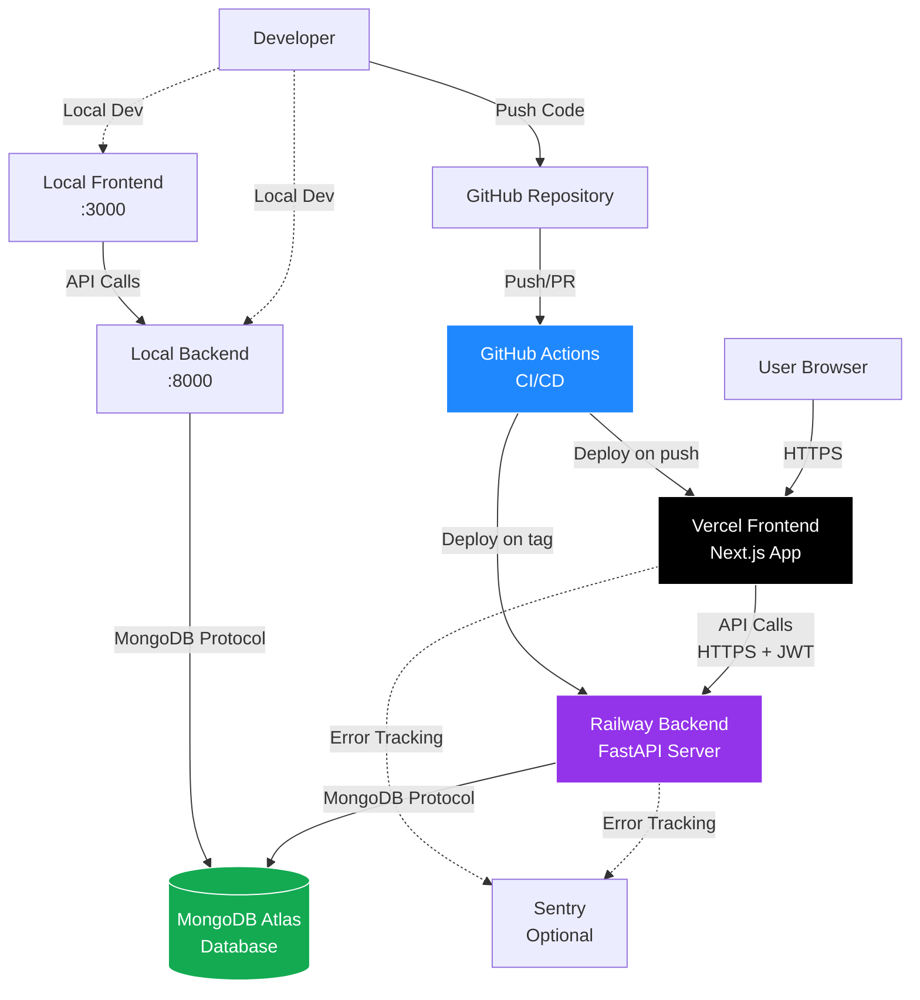

# High Level Architecture

## Technical Summary

Todox is a fullstack task management application built with a monolith architecture on both frontend and backend tiers. The frontend is a Next.js 14+ application using App Router with TypeScript and Shadcn UI components, providing a responsive, accessible user interface. The backend is a FastAPI Python application with modular organization (routes, services, repositories), communicating with a MongoDB Atlas database for data persistence. The two tiers communicate via a RESTful API with JWT-based authentication ensuring stateless, secure session management. The application deploys to Railway for backend hosting and Vercel for frontend hosting, both with automatic CI/CD pipelines. This architecture prioritizes simplicity, maintainability, and rapid MVP delivery while maintaining clean separation of concerns and testability through comprehensive Playwright E2E tests and unit tests on both tiers.

## Platform and Infrastructure Choice

**Platform:** Railway (Backend) + Vercel (Frontend) + MongoDB Atlas (Database)

**Key Services:**
- **Railway:** Backend API hosting with automatic deployments on tag pushes, environment variable management, log streaming
- **Vercel:** Frontend hosting with edge network CDN, automatic deployments on main branch, preview URLs for pull requests
- **MongoDB Atlas:** Managed MongoDB database with M0 free tier, connection pooling, automated backups
- **GitHub Actions:** CI/CD for linting, type checking, and automated testing before deployment

**Deployment Host and Regions:**
- Railway: Auto-selected region (typically US-based for free tier)
- Vercel: Global edge network with automatic CDN distribution
- MongoDB Atlas: Shared M0 cluster (region: nearest to Railway deployment)

**Rationale:** This stack provides zero-cost MVP deployment with minimal configuration while maintaining production-ready capabilities. Railway and Vercel both offer generous free tiers suitable for demonstration and initial user load. MongoDB Atlas M0 tier provides 512MB storage sufficient for MVP. The combination supports the October 2025 deadline with rapid deployment workflows and minimal infrastructure management overhead.

## Repository Structure

**Structure:** Monorepo with frontend and backend in separate directories

**Monorepo Tool:** Simple directory-based monorepo (no specialized tooling like Nx or Turborepo)

**Package Organization:**
- `/frontend` - Next.js application with all frontend code
- `/backend` - FastAPI application with all backend code
- Root-level shared configs (`.github/workflows`, `.gitignore`, `README.md`)
- Separate `package.json` (frontend) and `pyproject.toml`/`requirements.txt` (backend)
- No shared packages initially (can add if needed for type sharing in future iterations)

**Rationale:** Simple monorepo structure avoids complexity of workspace tools while keeping all code in a single repository. This supports atomic commits affecting both tiers, unified version control, and simplified CI/CD. For MVP scope with 2 distinct deployment targets, a basic directory structure is sufficient and reduces cognitive overhead for AI agents.

## High Level Architecture Diagram

## Architectural Patterns

- **Monolith Architecture:** Single deployable unit for both frontend and backend - _Rationale:_ MVP scope benefits from simplicity; avoids microservices complexity while maintaining clear separation via repository structure
- **JAMstack Principles:** JavaScript app (Next.js) + API (FastAPI) + Markup (SSR/SSG) - _Rationale:_ Leverages Vercel's edge network for fast static delivery while dynamic data comes from Railway API
- **Repository Pattern:** Abstract database operations behind repository interfaces - _Rationale:_ Separates data access from business logic, enabling easier testing and potential future database migrations
- **Service Layer:** Business logic in service classes, routes as thin controllers - _Rationale:_ Maintains testability, keeps routes focused on HTTP concerns, enables logic reuse
- **Component-Based UI:** React components with TypeScript and Shadcn UI primitives - _Rationale:_ Reusability, maintainability, type safety, and accessibility built into component library
- **JWT Stateless Authentication:** Token-based auth stored client-side, verified per request - _Rationale:_ Scales horizontally without session storage, suitable for separate frontend/backend deployments
- **API Gateway Pattern:** Single FastAPI app serving all API routes with CORS config - _Rationale:_ Centralized auth middleware, rate limiting potential, consistent error handling

---
