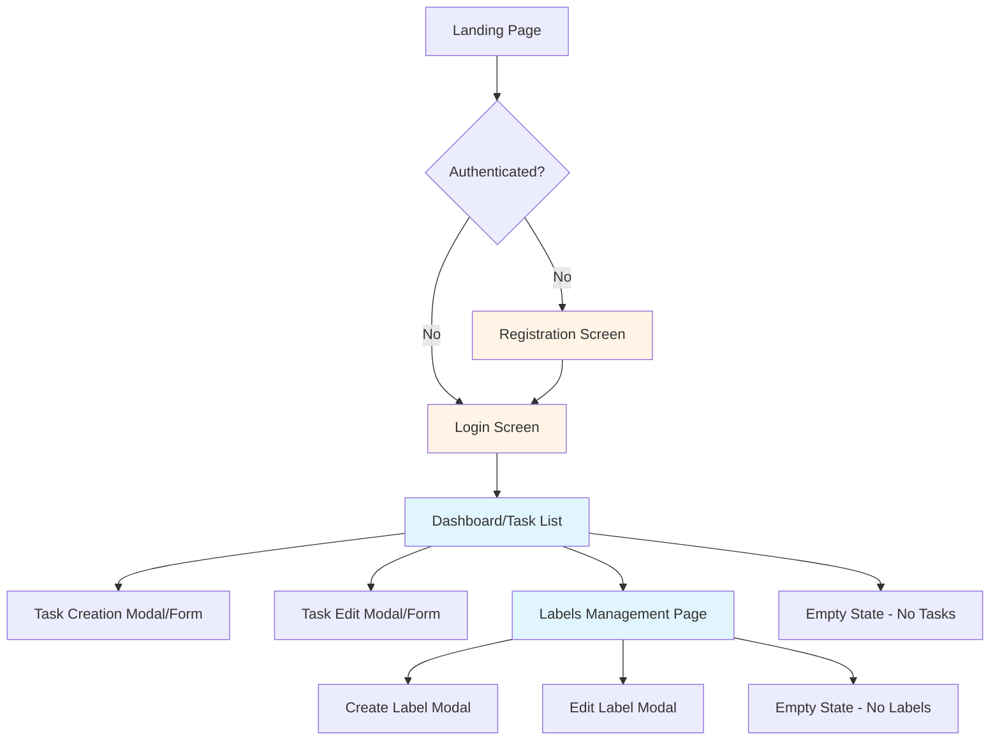
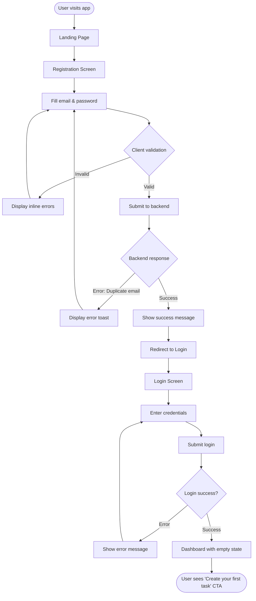
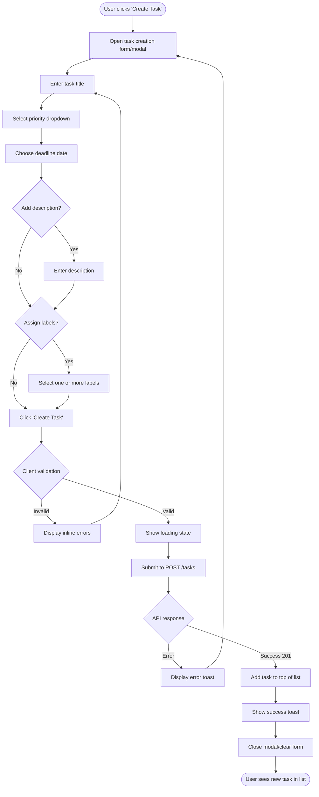
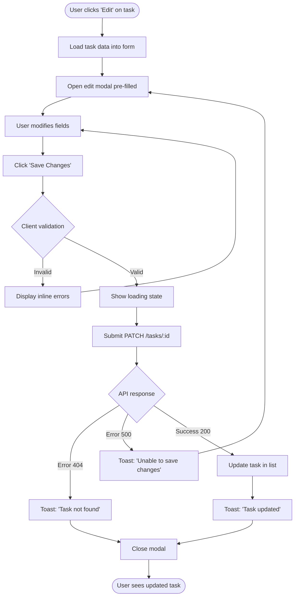
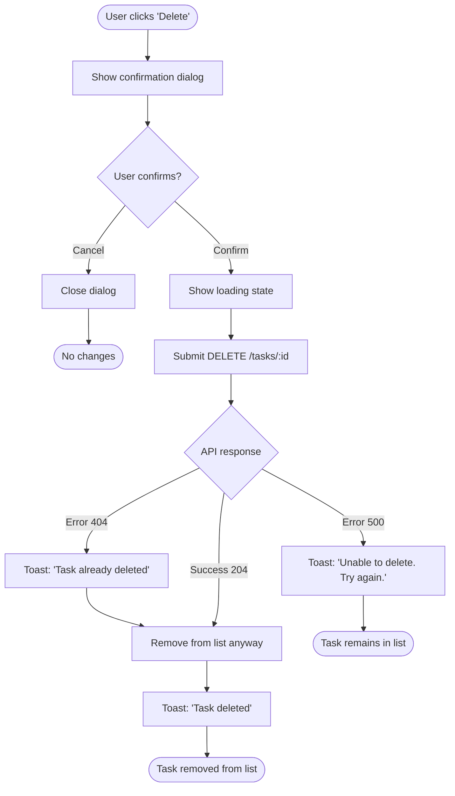
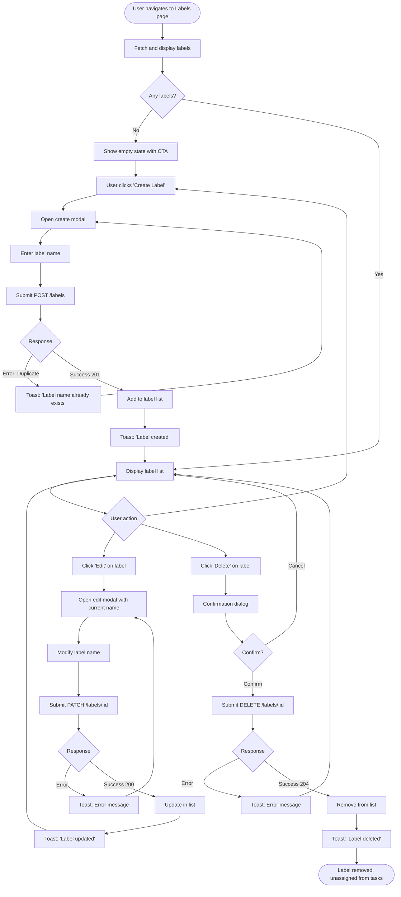

# Todox UI/UX Specification

## Introduction

This document defines the user experience goals, information architecture, user flows, and visual design specifications for Todox's user interface. It serves as the foundation for visual design and frontend development, ensuring a cohesive and user-centered experience.

### Overall UX Goals & Principles

#### Target User Personas

**Primary User: Task-Oriented Individual**
- Needs a simple, reliable system to track personal tasks
- Values clarity and speed over complex features
- Wants to quickly capture tasks and see priorities at a glance
- May use the app multiple times per day for quick check-ins
- Expects mobile-responsive design for on-the-go access

**Secondary User: Project Organizer**
- Uses labels to categorize tasks across different projects or contexts
- Needs to see task deadlines and priorities clearly
- Values the ability to quickly edit and reorganize tasks
- Appreciates empty states and clear guidance when starting fresh

#### Usability Goals

- **Ease of learning:** New users can create their first task within 30 seconds of registration
- **Efficiency of use:** Existing users can create a new task in under 10 seconds
- **Error prevention:** Clear validation messages and confirmation dialogs for destructive actions (delete)
- **Memorability:** Infrequent users can return and understand the interface without relearning
- **Visual feedback:** Every action provides immediate, clear feedback (loading states, success toasts, error messages)
- **Accessibility:** WCAG AA compliant with keyboard navigation and screen reader support

#### Design Principles

1. **Clarity over cleverness** - Use straightforward language and familiar UI patterns rather than innovative but confusing designs
2. **Progressive disclosure** - Show essential task information in list view; reveal details only when needed
3. **Immediate feedback** - Every user action (create, edit, delete) provides instant visual confirmation
4. **Graceful empty states** - Guide users with helpful messaging when no tasks or labels exist
5. **Mobile-first responsive** - Design for mobile viewports first, then enhance for larger screens

### Change Log

| Date | Version | Description | Author |
|------|---------|-------------|--------|
| 2025-01-12 | 1.0 | Initial frontend specification | Sally (UX Expert) |

---

## Information Architecture (IA)

### Site Map / Screen Inventory

**Screen Hierarchy:**
- **Public Area:** Landing, Login, Registration (unauthenticated)
- **Authenticated Area:** Dashboard/Task List (primary hub), Labels Management
- **Modals/Overlays:** Task Create, Task Edit, Label Create, Label Edit, Delete Confirmations

### Navigation Structure

**Primary Navigation:**
- Top navigation bar (or sidebar on larger screens) with:
  - **Tasks** - Link to main dashboard/task list (default view)
  - **Labels** - Link to labels management page
  - **User menu** - Dropdown with Logout option
- Mobile: Hamburger menu or bottom navigation bar

**Secondary Navigation:**
- Within Task List: Filter/sort controls (future enhancement placeholder)
- Within Labels page: Simple list with inline actions

**Breadcrumb Strategy:**
- Not required for MVP due to flat hierarchy
- Future consideration: Breadcrumbs if filtering or nested label categories are added

---

## User Flows

### User Flow 1: User Registration & First Login

**User Goal:** Create an account and access the application

**Entry Points:** Landing page, direct link to `/auth/register`

**Success Criteria:** User successfully registers, logs in, and sees the dashboard with empty state guidance

#### Flow Diagram

#### Edge Cases & Error Handling:
- Invalid email format → Inline error: "Please enter a valid email address"
- Password too short → Inline error: "Password must be at least 8 characters"
- Email already exists → Toast error: "An account with this email already exists. Please log in."
- Network error during registration → Toast error: "Unable to connect. Please try again."
- Successful registration but redirect fails → Auto-redirect with fallback manual link

**Notes:** Registration and login are separate pages to maintain clarity. Success toast on registration provides positive feedback before redirect.

---

### User Flow 2: Create a New Task

**User Goal:** Add a new task to the task list with title, priority, and deadline

**Entry Points:** 
- "Create Task" button on Dashboard
- Empty state CTA when no tasks exist

**Success Criteria:** Task is created, appears at top of task list, form is cleared or closed

#### Flow Diagram

#### Edge Cases & Error Handling:
- Missing title → Inline error: "Task title is required"
- No priority selected → Inline error: "Please select a priority"
- Invalid deadline format → Inline error: "Please enter a valid date"
- API error (500) → Toast: "Unable to create task. Please try again."
- Network timeout → Toast: "Connection lost. Your task was not saved."

**Notes:** Form should remain open on API error so user doesn't lose their input. Consider auto-saving to localStorage as future enhancement.

---

### User Flow 3: Edit an Existing Task

**User Goal:** Update task properties (title, description, priority, deadline, status, labels)

**Entry Points:**
- Click "Edit" button on task card
- Click directly on task title (future enhancement)

**Success Criteria:** Task is updated, changes reflected immediately in task list

#### Flow Diagram

#### Edge Cases & Error Handling:
- Task deleted by another session → 404 error, remove from list with message
- Network error → Keep modal open, show retry option
- User closes modal without saving → No API call, no changes persisted
- Validation errors → Same as create task flow

**Notes:** Optimistic UI updates (update list before API response) could improve perceived performance but add complexity for error handling. Start with pessimistic updates for MVP.

---

### User Flow 4: Delete a Task

**User Goal:** Remove a task from the task list permanently

**Entry Points:** Click "Delete" button on task card

**Success Criteria:** Task is deleted and removed from list after confirmation

#### Flow Diagram

#### Edge Cases & Error Handling:
- Task already deleted (404) → Remove from list, show neutral message
- Network error → Task stays in list, show error with retry option
- User accidentally confirms → No undo in MVP (future enhancement: toast with undo action)

**Notes:** Confirmation dialog should clearly state "Delete task: [task title]?" to prevent accidental deletions.

---

### User Flow 5: Manage Labels

**User Goal:** Create, edit, and delete custom labels for task organization

**Entry Points:** 
- Click "Labels" in main navigation
- Empty state in task creation when no labels exist (link to labels page)

**Success Criteria:** Labels are created/edited/deleted and available for assignment to tasks

#### Flow Diagram

#### Edge Cases & Error Handling:
- Duplicate label name → Toast: "A label with this name already exists"
- Deleting label assigned to tasks → Confirm dialog mentions: "This label will be removed from all tasks"
- Empty label name → Inline error: "Label name is required"
- Network errors → Standard error handling with retry options

**Notes:** Label deletion should cascade to tasks (remove label_id from tasks' label_ids arrays) - handled on backend.

---

## Wireframes & Mockups

**Primary Design Files:** Design files will be created in Figma (to be linked once available). For MVP, Shadcn UI components will provide consistent design patterns without custom mockups.

### Key Screen Layouts

#### Login Screen

**Purpose:** Authenticate existing users to access their task data

**Key Elements:**
- App logo/branding at top
- Centered card/form containing:
  - Email input field (type="email", required)
  - Password input field (type="password", required)
  - "Log In" primary button
  - Error message area (conditionally shown)
- Link to registration: "Don't have an account? Sign up"
- Loading spinner on button during submission

**Interaction Notes:**
- Form submission on Enter key
- Client-side validation before submission
- Disabled button and loading state during API call
- Error messages display as toast notifications or inline below form
- Auto-focus email field on page load

**Design File Reference:** shadcn/ui Card, Input, Button components

---

#### Registration Screen

**Purpose:** Allow new users to create an account

**Key Elements:**
- App logo/branding at top
- Centered card/form containing:
  - Email input field (type="email", required, with validation pattern)
  - Password input field (type="password", required, minlength="8")
  - Password requirements hint (e.g., "At least 8 characters")
  - "Create Account" primary button
  - Validation error messages (inline below fields)
- Link to login: "Already have an account? Log in"
- Loading spinner on button during submission

**Interaction Notes:**
- Real-time validation feedback (email format, password length)
- Form submission on Enter key
- Success toast on registration, then redirect to login
- Error handling for duplicate email

**Design File Reference:** shadcn/ui Card, Input, Button, Label components

---

#### Dashboard / Task List

**Purpose:** Primary view displaying all user tasks with actions to create, edit, delete, and manage tasks

**Key Elements:**
- **Top Navigation Bar:**
  - App logo (left)
  - Navigation links: Tasks (active), Labels
  - User menu dropdown (right): Logout option
  
- **Page Header:**
  - Page title: "My Tasks"
  - "Create Task" primary button (right side)
  
- **Task List:**
  - Each task card displays:
    - Checkbox for status (open/done) - toggles inline
    - Task title (prominent, crossed out if done)
    - Priority indicator (colored badge: High=red, Medium=orange, Low=blue)
    - Deadline date (formatted: "Due: Jan 15, 2025")
    - Label chips (if assigned) - small colored badges with label names
    - Action buttons (right side): Edit icon, Delete icon
  - Tasks sorted by created_at descending (newest first)
  - Responsive grid/list layout
  
- **Empty State (no tasks):**
  - Illustration or icon
  - Message: "No tasks yet. Create your first task to get started!"
  - "Create Task" CTA button

- **Loading State:**
  - Skeleton loaders for task cards during initial fetch

**Interaction Notes:**
- Clicking checkbox immediately updates task status via PATCH request
- Edit button opens task edit modal
- Delete button shows confirmation dialog
- Task cards are keyboard accessible (tab navigation, Enter to edit, Del key for delete)
- Responsive: Single column on mobile, 2-3 columns on tablet/desktop

**Design File Reference:** shadcn/ui Card, Badge, Button, Checkbox, Dialog components

---

#### Task Creation Modal

**Purpose:** Focused interface for adding a new task with all required and optional fields

**Key Elements:**
- Modal overlay with centered form card
- Modal header: "Create New Task" with close (X) button
- Form fields:
  - **Title:** Text input, required, auto-focused, placeholder: "Enter task title"
  - **Description:** Textarea, optional, placeholder: "Add a description (optional)"
  - **Priority:** Select dropdown, required, options: High, Medium, Low
  - **Deadline:** Date picker, required, placeholder: "Select deadline date"
  - **Labels:** Multi-select dropdown or checkbox list, optional, shows available labels
- Form actions:
  - "Cancel" secondary button (closes modal)
  - "Create Task" primary button (submits form)
- Validation error messages display inline below fields
- Loading spinner on submit button during API call

**Interaction Notes:**
- Modal closes on Cancel or successful creation
- Clicking outside modal does not close (prevents accidental loss)
- Escape key closes modal with confirmation if fields are filled
- Form clears after successful creation
- Tab navigation through fields

**Design File Reference:** shadcn/ui Dialog, Input, Textarea, Select, Button, Label components

---

#### Task Edit Modal

**Purpose:** Modify existing task properties

**Key Elements:**
- Modal overlay with centered form card
- Modal header: "Edit Task" with close (X) button
- Form fields (pre-filled with current task data):
  - Title (text input, required)
  - Description (textarea, optional)
  - Priority (select dropdown, required)
  - Deadline (date picker, required)
  - Status (toggle/checkbox: Open / Done)
  - Labels (multi-select, optional)
- Form actions:
  - "Cancel" secondary button
  - "Save Changes" primary button
- Validation and loading states same as create modal

**Interaction Notes:**
- Same interaction patterns as create modal
- Changes only saved on "Save Changes" click
- Cancel discards changes (no confirmation needed unless form is dirty - future enhancement)

**Design File Reference:** shadcn/ui Dialog, Input, Textarea, Select, Button, Switch components

---

#### Labels Management Page

**Purpose:** Create, edit, and delete custom labels

**Key Elements:**
- **Page Header:**
  - Page title: "Labels"
  - "Create Label" primary button
  
- **Labels List:**
  - Each label row displays:
    - Label name (prominent)
    - Action buttons: Edit icon, Delete icon
  - Alphabetically sorted
  - Simple list or card layout
  
- **Empty State (no labels):**
  - Icon or illustration
  - Message: "No labels yet. Create labels to organize your tasks."
  - "Create Label" CTA button

- **Create/Edit Label Modal:**
  - Modal header: "Create Label" or "Edit Label"
  - Single text input: "Label Name" (required)
  - Form actions: Cancel, Create/Save button
  - Validation error for duplicate names

**Interaction Notes:**
- Create/Edit modals are simple single-field forms
- Delete shows confirmation: "Delete label '[name]'? It will be removed from all tasks."
- Same responsive patterns as task list

**Design File Reference:** shadcn/ui Card, Button, Dialog, Input components

---

## Component Library / Design System

**Design System Approach:** Todox will use **Shadcn UI** as the component foundation, customized with Tailwind CSS for brand colors and spacing. Shadcn provides accessible, unstyled primitives that can be adapted to project needs without heavy framework overhead.

### Core Components

#### Button

**Purpose:** Primary interactive element for actions throughout the application

**Variants:**
- **Primary:** Solid background, high contrast (main CTAs like "Create Task", "Log In")
- **Secondary:** Outlined or ghost style (Cancel, secondary actions)
- **Destructive:** Red variant for dangerous actions (Delete confirmation)
- **Icon Button:** Small, square/circle, icon-only (Edit, Delete, Close)

**States:**
- Default
- Hover (slight color shift, cursor pointer)
- Active/pressed (darker shade)
- Disabled (reduced opacity, cursor not-allowed)
- Loading (spinner icon, disabled)

**Usage Guidelines:**
- Use primary buttons for main action on a page (one per screen)
- Secondary buttons for alternative or cancel actions
- Destructive buttons only in confirmation dialogs
- Icon buttons for space-constrained actions (task cards)

---

#### Input / Text Field

**Purpose:** Collect text input from users (email, task title, label name, etc.)

**Variants:**
- **Text:** Single-line input (default)
- **Email:** Email validation pattern
- **Password:** Masked input with show/hide toggle (future enhancement)
- **Textarea:** Multi-line input (task description)

**States:**
- Default (neutral border)
- Focus (highlighted border, focus ring)
- Error (red border, error message below)
- Disabled (grayed out, not editable)
- Success (green border for confirmed valid input - optional)

**Usage Guidelines:**
- Always include visible label (not just placeholder)
- Placeholder text for hints, not labels
- Error messages appear below input, not replacing label
- Use appropriate input types for semantic HTML and mobile keyboards

---

#### Select / Dropdown

**Purpose:** Choose one option from a predefined list (priority, status)

**Variants:**
- **Single Select:** Choose one option (priority dropdown)
- **Multi-Select:** Choose multiple options (labels assignment) - can use Combobox or Checkbox list

**States:**
- Default (closed)
- Open (dropdown menu visible)
- Focus (keyboard navigation)
- Selected (checkmark or highlighted option)
- Disabled

**Usage Guidelines:**
- Use for 3+ options (use radio buttons for 2 options)
- Clearly indicate current selection
- Support keyboard navigation (arrow keys, Enter to select)
- Mobile: Leverage native select for better UX

---

#### Badge / Chip

**Purpose:** Display compact, categorized information (priority, labels, status)

**Variants:**
- **Priority Badges:** High (red), Medium (orange), Low (blue)
- **Label Chips:** Neutral colors, removable (X icon) when editing task
- **Status Badge:** Open (default), Done (green with checkmark)

**States:**
- Static (non-interactive)
- Removable (with X icon on hover)

**Usage Guidelines:**
- Use color sparingly, ensure sufficient contrast
- Keep text short (1-2 words)
- Consistent sizing across application
- Group multiple badges with proper spacing

---

#### Card

**Purpose:** Container for grouped content (task cards, form modals, empty states)

**Variants:**
- **Task Card:** Shadow, rounded corners, hover effect
- **Form Card:** Centered, prominent, clear boundaries
- **Empty State Card:** Minimal, centered, with illustration

**States:**
- Default
- Hover (subtle shadow increase for interactive cards)
- Active/selected (optional, for future filtering)

**Usage Guidelines:**
- Consistent padding and spacing
- Use shadow to indicate hierarchy
- Rounded corners for friendly appearance
- Ensure touch targets are large enough on mobile (min 44x44px)

---

#### Modal / Dialog

**Purpose:** Focus user attention on specific task (create/edit task, confirmations)

**Variants:**
- **Form Modal:** Large, contains form fields
- **Confirmation Dialog:** Small, contains message and action buttons
- **Alert Dialog:** Small, informational (optional for MVP)

**States:**
- Open (overlay visible, content animated in)
- Closed (not rendered)

**Usage Guidelines:**
- Use sparingly, only for focused tasks requiring user decision
- Always provide clear close option (X button, Cancel button)
- Escape key should close modal (with confirmation if form is dirty)
- Click outside to close for non-critical modals (not for forms with data)
- Trap focus within modal when open
- Disable background scrolling when modal is open

---

#### Toast / Notification

**Purpose:** Provide temporary, non-intrusive feedback for actions

**Variants:**
- **Success:** Green, checkmark icon ("Task created", "Label updated")
- **Error:** Red, X icon ("Unable to save", "Connection lost")
- **Info:** Blue, info icon (neutral notifications)

**States:**
- Visible (animates in from top or bottom)
- Dismissing (fades out after timeout or user dismisses)

**Usage Guidelines:**
- Auto-dismiss after 3-5 seconds for success/info
- Allow manual dismiss for errors (user may need to read)
- Stack multiple toasts if needed (max 3 visible)
- Position consistently (top-right or bottom-center)
- Keep messages concise and actionable

---

#### Checkbox

**Purpose:** Toggle binary state (task completion status)

**Variants:**
- **Standard Checkbox:** Task status toggle in list
- **Checkbox with Label:** Form fields (future multi-select)

**States:**
- Unchecked (empty box)
- Checked (checkmark visible)
- Indeterminate (partial check, optional for future use)
- Disabled
- Focus (keyboard navigation)

**Usage Guidelines:**
- Large enough for touch (min 24x24px)
- Clear visual distinction between checked/unchecked
- Immediate feedback on toggle (optimistic UI update)
- Label clickable to toggle checkbox

---

## Branding & Style Guide

### Visual Identity

**Brand Guidelines:** Todox uses a clean, professional design aesthetic with a focus on usability and accessibility. The brand emphasizes simplicity, clarity, and efficiency—reflecting the app's core purpose of straightforward task management.

### Color Palette

| Color Type | Hex Code | Usage |
|------------|----------|-------|
| Primary | `#3b82f6` (Blue 500) | Primary buttons, links, focus states, app branding |
| Secondary | `#64748b` (Slate 500) | Secondary buttons, inactive elements, supporting text |
| Accent | `#8b5cf6` (Violet 500) | Interactive highlights, hover states (optional) |
| Success | `#10b981` (Green 500) | Positive feedback, success toasts, "Done" status |
| Warning | `#f59e0b` (Amber 500) | Medium priority tasks, caution notices |
| Error | `#ef4444` (Red 500) | Errors, destructive actions, High priority tasks, delete confirmations |
| Neutral | `#f1f5f9` (Slate 100) for backgrounds, `#1e293b` (Slate 800) for text | Text, borders, backgrounds, dividers |

**Priority-Specific Colors:**
- **High Priority:** `#ef4444` (Red 500) - Urgent, needs immediate attention
- **Medium Priority:** `#f59e0b` (Amber 500) - Important but not urgent
- **Low Priority:** `#3b82f6` (Blue 500) - Standard importance

**Color Contrast:**
- All text meets WCAG AA contrast ratios (4.5:1 for normal text, 3:1 for large text)
- Interactive elements have sufficient contrast in all states

### Typography

#### Font Families

- **Primary:** Inter (sans-serif) - Clean, modern, highly readable at all sizes
- **Secondary:** System font stack fallback: `-apple-system, BlinkMacSystemFont, "Segoe UI", Roboto, "Helvetica Neue", Arial, sans-serif`
- **Monospace:** `"Fira Code", "Courier New", monospace` (for code snippets if needed in future, not required for MVP)

#### Type Scale

| Element | Size | Weight | Line Height |
|---------|------|--------|-------------|
| H1 | 2.25rem (36px) | 700 (Bold) | 1.2 |
| H2 | 1.875rem (30px) | 600 (Semibold) | 1.3 |
| H3 | 1.5rem (24px) | 600 (Semibold) | 1.4 |
| Body | 1rem (16px) | 400 (Regular) | 1.5 |
| Small | 0.875rem (14px) | 400 (Regular) | 1.4 |
| Button | 0.875rem (14px) | 500 (Medium) | 1 |
| Label | 0.875rem (14px) | 500 (Medium) | 1.4 |

**Typography Guidelines:**
- Use H1 for page titles ("My Tasks", "Labels")
- Use H2 for modal titles ("Create New Task")
- Use H3 sparingly for section headings
- Body text for task descriptions, form help text
- Small text for secondary information (timestamps, metadata)

### Iconography

**Icon Library:** Lucide React (default with Shadcn UI)
- Consistent stroke width (2px)
- 24x24px default size, 16x16px for small icons
- Icons accompany text labels for clarity (don't rely on icons alone)

**Common Icons:**
- `Plus` - Create/Add actions
- `Pencil` - Edit actions
- `Trash2` - Delete actions
- `Check` - Completion, success confirmations
- `X` - Close modals, remove items, errors
- `Calendar` - Deadline/date fields
- `Tag` - Labels/categories
- `LogOut` - Logout action
- `Menu` - Mobile navigation toggle

**Usage Guidelines:**
- Use icons consistently across the app
- Pair icons with text labels for accessibility
- Ensure icons have sufficient size for touch targets
- Use aria-labels for icon-only buttons

### Spacing & Layout

**Grid System:**
- Mobile-first responsive grid using Tailwind CSS utility classes
- Container max-width: 1280px (centered on large screens)
- Gutter spacing: 1rem (16px) on mobile, 1.5rem (24px) on desktop

**Spacing Scale (Tailwind CSS):**
- `4px` (0.25rem) - xs: Tight spacing between related elements
- `8px` (0.5rem) - sm: Standard spacing within components
- `16px` (1rem) - md: Spacing between components
- `24px` (1.5rem) - lg: Spacing between sections
- `32px` (2rem) - xl: Spacing between major page sections
- `48px` (3rem) - 2xl: Top/bottom page padding

**Layout Principles:**
- Consistent spacing using Tailwind's spacing scale
- Whitespace to improve scannability and reduce cognitive load
- Align elements to a visual grid for harmony
- Responsive padding: Reduce on mobile, increase on desktop

---

## Accessibility Requirements

### Compliance Target

**Standard:** WCAG 2.1 Level AA

### Key Requirements

**Visual:**
- **Color contrast ratios:** All text meets 4.5:1 minimum (normal text), 3:1 (large text 18px+)
- **Focus indicators:** Visible focus rings on all interactive elements (default browser or custom with sufficient contrast)
- **Text sizing:** All text is resizable up to 200% without loss of functionality
- **Color is not sole indicator:** Priority badges use both color and text label

**Interaction:**
- **Keyboard navigation:** All interactive elements accessible via Tab key, logical focus order
- **Screen reader support:** Semantic HTML (buttons, headings, labels), ARIA labels for icon buttons, aria-live regions for dynamic content (toasts)
- **Touch targets:** Minimum 44x44px for all interactive elements on touch devices

**Content:**
- **Alternative text:** All meaningful images have descriptive alt text (icons paired with text or aria-label)
- **Heading structure:** Logical heading hierarchy (h1 → h2 → h3), no skipped levels
- **Form labels:** All inputs have associated labels (not just placeholders), error messages linked via aria-describedby

### Testing Strategy

- **Automated:** Run axe DevTools or Lighthouse accessibility audits during development
- **Manual keyboard testing:** Ensure all functionality accessible without mouse
- **Screen reader testing:** Test with VoiceOver (macOS/iOS) or NVDA (Windows)
- **Color contrast:** Use WebAIM Contrast Checker for all text/background combinations
- **Responsive testing:** Verify touch targets and text sizing on mobile devices

---

## Responsiveness Strategy

### Breakpoints

| Breakpoint | Min Width | Max Width | Target Devices |
|------------|-----------|-----------|----------------|
| Mobile | 0px | 639px | Smartphones (portrait and landscape) |
| Tablet | 640px | 1023px | Tablets (portrait and landscape), small laptops |
| Desktop | 1024px | 1279px | Laptops, desktop monitors |
| Wide | 1280px | - | Large desktop monitors, widescreen displays |

**Tailwind CSS Breakpoints:**
- `sm:` 640px
- `md:` 768px
- `lg:` 1024px
- `xl:` 1280px
- `2xl:` 1536px

### Adaptation Patterns

**Layout Changes:**
- **Mobile (0-639px):** Single column layout, full-width cards, stacked forms
- **Tablet (640-1023px):** 2-column grid for task list, side-by-side form fields where appropriate
- **Desktop (1024px+):** 3-column grid for task list, horizontal navigation, modals centered with max-width

**Navigation Changes:**
- **Mobile:** Hamburger menu or bottom navigation bar (icon-based), collapsible user menu
- **Tablet/Desktop:** Horizontal top navigation bar with text labels, dropdown user menu in top-right

**Content Priority:**
- **Mobile:** Hide non-essential metadata (creation date, description preview), focus on title, priority, deadline
- **Tablet/Desktop:** Show more task metadata, expand descriptions inline

**Interaction Changes:**
- **Mobile:** Larger touch targets (min 44x44px), swipe gestures for future enhancements (e.g., swipe to delete)
- **Tablet/Desktop:** Hover states visible, smaller click targets acceptable (min 32x32px)

---

## Animation & Micro-interactions

### Motion Principles

- **Purposeful:** Animations guide attention and provide feedback, not decoration
- **Fast:** Transitions should be quick (150-300ms) to feel responsive, not sluggish
- **Subtle:** Avoid excessive motion that distracts or causes motion sickness
- **Accessible:** Respect prefers-reduced-motion media query for users with motion sensitivity

### Key Animations

- **Modal Open/Close:** Fade in overlay (200ms), scale up modal content from 95% to 100% (200ms), ease-out easing
- **Toast Notifications:** Slide in from top (200ms), fade out after 3-5 seconds (300ms), ease-in-out easing
- **Button Hover:** Background color transition (150ms), subtle scale (1.02x) on primary buttons, ease-in-out easing
- **Checkbox Toggle:** Checkmark fade in (150ms), background color change (150ms), ease-out easing
- **Task Card Hover:** Shadow intensity increase (200ms), ease-out easing
- **Loading States:** Skeleton loaders with shimmer effect (1500ms loop), spinner rotation (1s infinite loop)
- **Form Validation:** Error message slide down (200ms), input border color change (150ms), ease-out easing

**Implementation Notes:**
- Use Tailwind CSS transition utilities for simple transitions
- Use Framer Motion or CSS keyframes for complex animations
- Test with `prefers-reduced-motion: reduce` media query and disable non-essential animations

---

## Performance Considerations

### Performance Goals

- **Page Load:** First Contentful Paint (FCP) < 1.5 seconds, Largest Contentful Paint (LCP) < 2.5 seconds
- **Interaction Response:** Button clicks and form submissions should show loading state within 100ms, API responses displayed within 500ms
- **Animation FPS:** All animations maintain 60 FPS on target devices (no jank)

### Design Strategies

- **Optimized Images:** Use modern formats (WebP), appropriate sizing for device resolution, lazy loading for below-fold images
- **Code Splitting:** Load only necessary JavaScript for current page/route (Next.js automatic code splitting)
- **Skeleton Loaders:** Display skeleton screens instead of blank pages during data fetching to improve perceived performance
- **Optimistic UI Updates:** Update UI immediately for status changes (checkbox toggle) before API confirmation, rollback on error
- **Minimal Dependencies:** Use Shadcn UI (unstyled primitives) to avoid large component library bundles
- **Font Optimization:** Use system fonts with `font-display: swap` for web fonts, subset fonts to include only used characters
- **Debounce/Throttle:** Apply to search/filter inputs if implemented in future (not needed for MVP)

---

## Next Steps

### Immediate Actions

1. **Review and Approval:** Share this UI/UX specification with stakeholders (developer, project lead) for feedback and sign-off
2. **Create Component Inventory:** Set up Shadcn UI in Next.js project and confirm component availability
3. **Build Design Tokens:** Configure Tailwind CSS with custom color palette, spacing, and typography scale from this spec
4. **Prototype Key Screens:** Create basic HTML/React prototypes for dashboard and task creation flow to validate interactions
5. **Accessibility Audit Setup:** Configure axe DevTools or Lighthouse CI for automated accessibility testing from day one
6. **Handoff to Architect:** Provide this spec to the Design Architect for detailed frontend architecture document (component structure, state management, API integration patterns)

### Design Handoff Checklist

- [x] All user flows documented
- [x] Component inventory complete
- [x] Accessibility requirements defined (WCAG AA)
- [x] Responsive strategy clear (mobile-first, breakpoints defined)
- [x] Brand guidelines incorporated (colors, typography, spacing)
- [x] Performance goals established (FCP, LCP, interaction response)

---

## Checklist Results

**UI/UX Specification Completeness Check:**

✅ **Introduction & Goals**
- UX goals, personas, and design principles clearly defined
- Target user personas reflect task management use cases

✅ **Information Architecture**
- Site map covers all screens (auth, dashboard, labels, modals)
- Navigation structure defined for mobile and desktop

✅ **User Flows**
- 5 critical flows documented with Mermaid diagrams
- Edge cases and error handling specified for each flow

✅ **Wireframes & Screen Layouts**
- Key screens described: Login, Registration, Dashboard, Task Modals, Labels page
- Shadcn UI components identified for each screen

✅ **Component Library**
- 8 core components defined with variants, states, and usage guidelines
- Component library approach (Shadcn UI) specified

✅ **Branding & Style Guide**
- Color palette with semantic naming and priority-specific colors
- Typography scale with Inter font family
- Iconography (Lucide React) and spacing system (Tailwind)

✅ **Accessibility**
- WCAG AA compliance target set
- Visual, interaction, and content requirements detailed
- Testing strategy defined

✅ **Responsiveness**
- Mobile-first breakpoints defined (640px, 1024px, 1280px)
- Adaptation patterns for layout, navigation, and interaction

✅ **Animation & Performance**
- Motion principles and key animations specified (with durations and easing)
- Performance goals for FCP, LCP, and interaction response
- Design strategies for optimization

**Overall Assessment:** Frontend specification is comprehensive and ready for handoff to the Architect for detailed technical implementation planning. All sections from the template are complete with appropriate detail for MVP scope.
